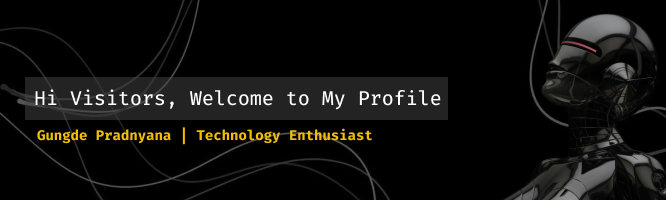

<!--
**GungDeJong/GungDeJong** is a ✨ _special_ ✨ repository because its `README.md` (this file) appears on your GitHub profile.

Here are some ideas to get you started:

- 🔭 I’m currently working on ...
- 🌱 I’m currently learning ...
- 👯 I’m looking to collaborate on ...
- 🤔 I’m looking for help with ...
- 💬 Ask me about ...
- 📫 How to reach me: ...
- 😄 Pronouns: ...
- ⚡ Fun fact: ...
-->

## 🌻About Me

Hi, I'm Agung Pradnyana 👋

I'm a passionate data science and tech enthusiast, currently exploring new technologies and developing several interesting tech projects. With a background in Informatics, I love building projects that solve real-world problems and continuously improving my skills in data science, AI and web.

Feel free to check out my repositories and **let's connect with me:**

  

---

## 🧑🏻‍💻Tech Stack

  

  

---

## 📊 GitHub Stats

  

  

  

---
## 🎮 Play Pacman

<picture>
  <source media="(prefers-color-scheme: dark)" srcset="https://raw.githubusercontent.com/GungDeJong/GungDeJong/output/pacman-contribution-graph-dark.svg">
  <source media="(prefers-color-scheme: light)" srcset="https://raw.githubusercontent.com/GungDeJong/GungDeJong/output/pacman-contribution-graph.svg">
  
</picture>

